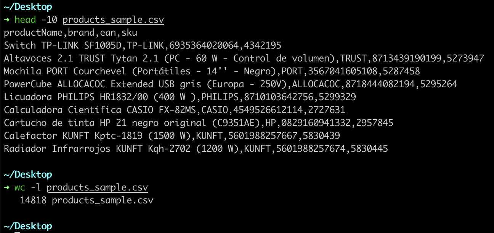
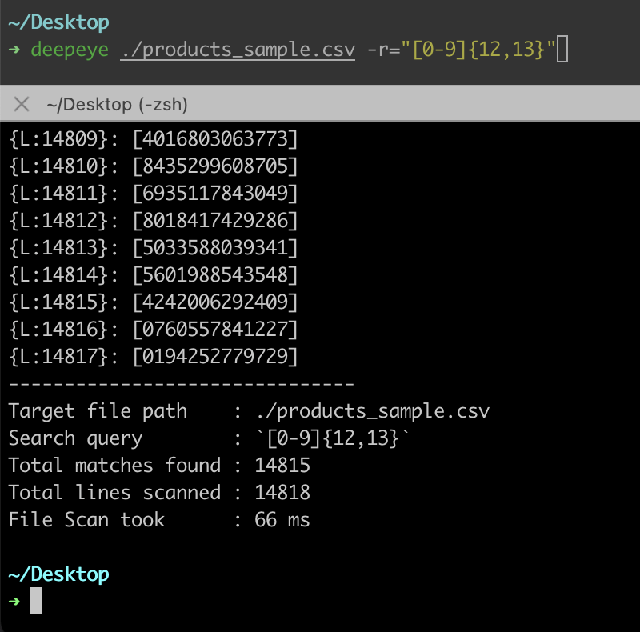
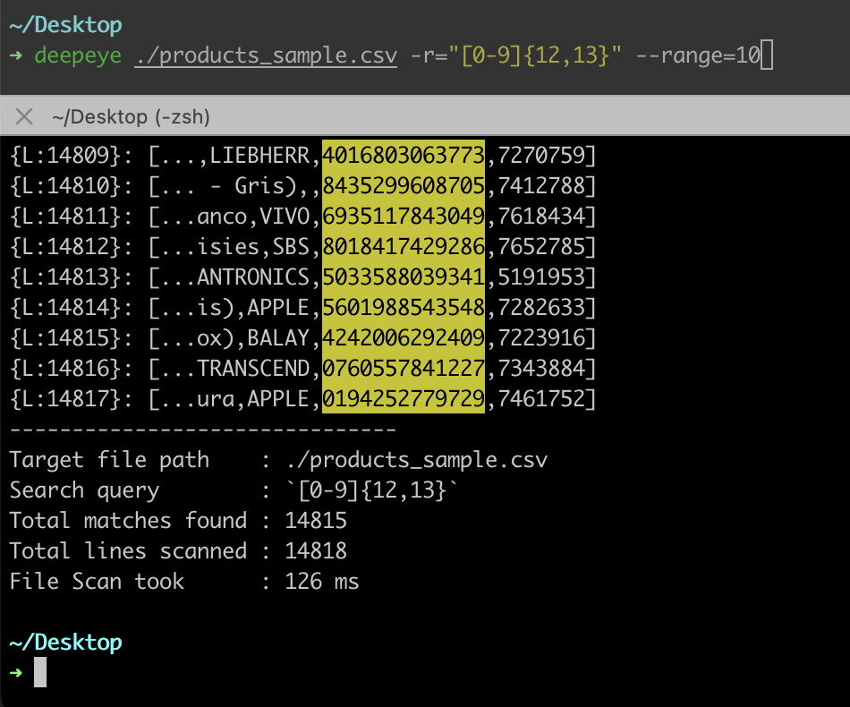
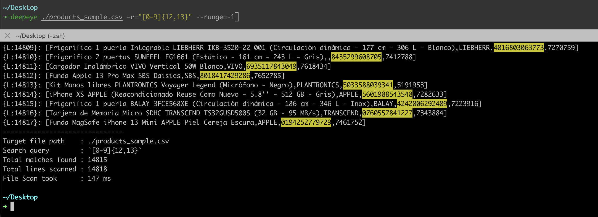
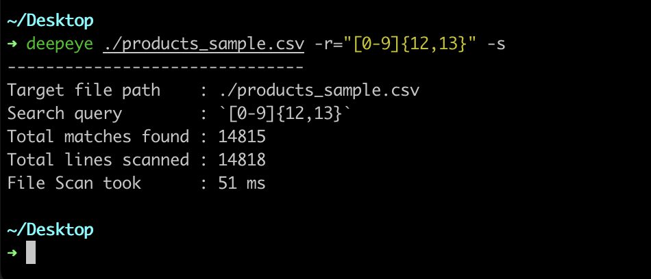
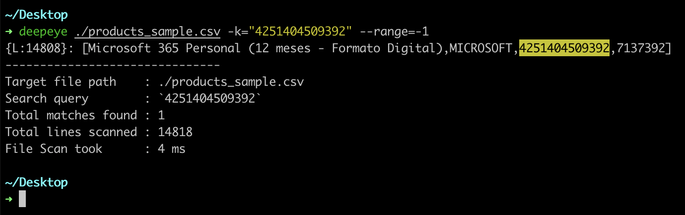

[](https://github.com/aallali/DeepEye "Go to GitHub repo") | [](https://github.com/aallali/DeepEye/releases/) |  [](https://github.com/aallali/DeepEye/blob/main/LICENSE) | [](https://github.com/aallali/DeepEye/issues)|[](https://github.com/aallali/DeepEye)|[](https://github.com/aallali/DeepEye) | [](https://golang.org "Go to Go homepage")
|:---:|:---:|:---:|:---:|:---:|:---:|:---:|


## Description:
**DeepEye** a CLI  that simply help you make search queries through files quickly using plain text or regex expressions, while having detailed output about it.
The project meant to be simple and HELPFUL

**If you visited this page, leave a ⭐️ on this repo so i can see you, means a lot :)**
Suggestions and helps are welcome.
## Usage:
```
➜ deepeye -h
DeepEye: a CLI that will allow you to run advanced search queries
	through multipe text files, while having customized + detailed output.
	The "deepeye" program was mainly focused on helping terminal users,
	to quickly search in files in both plain text and regex queries.

Willing to contribute? : "https://github.com/aallali/deepeye/"

Author: Abdellah Allali <hi@allali.me>
Birth: 24/05/2023
First release: 30/05/2023

Usage:
  deepeye <filename> flags [flags]

Flags:
  -h, --help             help for deepeye
  -k, --keyword string   Keyword to match in file.
      --range int        the range of characters around the match to print. default:0
  -r, --regex string     regex expression to match in file.
  -s, --silent           if you want to silent the comand, only resume will be printed. default:false
  -u, --update           check for updates. default:false
  -v, --version          output the current installed version of DeepEye CLI. default:false

```
```
➜ deepeye -v
DeepEye v0.0.1
```
```
➜ deepeye -u
Checking ...
You are running the latest version of DeepEye: 0.0.1
```
## Examples:
<!-- EXMP0 -->
- *products_sample.csv* a simple file with dummy data of random products (+14k lines).

<!-- EXMP1 -->
- search for all EAN numbers in the csv file which is 12-13 number (universal format) 

**`deepeye ./products_sample.csv -r="[0-9]{12,13}"`**

(all the found 14815 are printed to console here, just cut last part here)
(the prefix `{L:14...}` tell the line number where the match has been found in file)



<!-- EXMP2 -->
- same previous query but print 10 characters around the match (margin 10 characters) using **--range** flag

**`deepeye ./products_sample.csv -r="[0-9]{12,13}" --range=10`**



<!-- EXMP3 -->
- same previous query but print full line of match using **--range=-1** flag

**`deepeye ./products_sample.csv -r="[0-9]{12,13}" --range=-1`**



<!-- EXMP4 -->
- same previous query but without printing the matched results using the silent flag **`-s`**

**`deepeye ./products_sample.csv -r="[0-9]{12,13}" -s`**
(only stats are printed)


<!-- EXMP5 -->

- search for this random ean and print the full line, as it shows here, this product exists in row number : 14808

**`deepeye ./products_sample.csv -k="book" --range=-1`**




## Features:
- ✅ search with text keyword
- ✅ search with regex expression
- ✅ add option to choose output : full line of match OR match with N chars range around it (`flag:--range`)
- ⏳ add option to limit number of lines to output.
- ⏳ make the auto update functionality
- ✅ write installer script (need improvements)
- ⏳ add queries history option (pick already used queries)

✅ = Ready to use
⏳ = In progress

## ToFix:
- :rotating_light: write unit tests!
- ⏳ make real fix to use case of `SpotAndMargin(...)` in Regex option to prevent it from running over unmatched regex but same keyword.

🚨 = Urgent
## Flags:
| flag/args | default | accepted values | description
| --- | --- | --- | --- |
| path/to/file | required as first argument | valid file path | path the file to search in |
| `-k`<br>`--keyword` | required<br>(`if -r not present`) | string | if you want to search with a static keyword,<br>e.g: `-k=";1337;"` |
| `-r`<br>`--regex` | required<br>(`if -k not present`) | regex expression| if you want to search with a regex expression ,<br>e.g: `-r="(?<=;)[0-9]+(?=;)"` |
| `-s`<br>`--silent` | `false` | boolean | if you want to print the statistics of result only, without matched lines |
| `--range` | `0` | number<br>(`positive or -1`)| the range of characters desired to print around the match (margin), <br>`0`: print only the matched string <br> `x`: print x characters on the left and right of matched string<br>`-1`: print full line |
| `-h`<br>`--help` | false | boolean | print the help guide to use the command|
| `-v`<br>`--version` | false | boolean | print installed version of DeepEye |
| `-u`<br>`--update` | false | boolean | check for any available updates |


## installation:

- run the command : 
  ```
  wget -qO- https://github.com/aallali/DeepEye/raw/main/install.sh | sudo bash
  ```
  or clone the clone and compile it yourself.
## Releases:
- 30-05-2023 : **[[0.0.1]((https://github.com/aallali/DeepEye/releases/tag/v0.0.1))]**


## Maintainers:
- [Abdellah Allali](https://github.com/aallali)
- [your name here](./CONTRIBUTING.md)

## Contributors:
- Be the first :) 

## Licence:
MIT License
