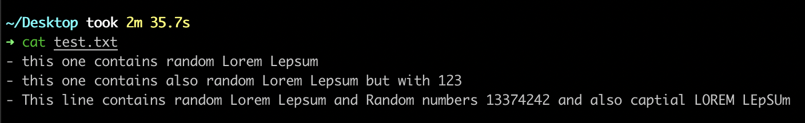
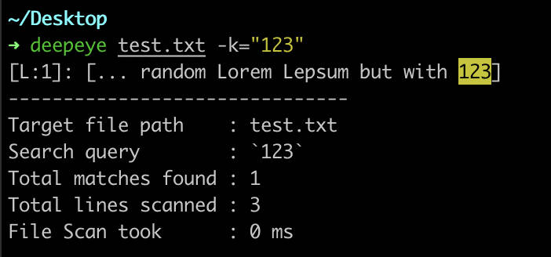
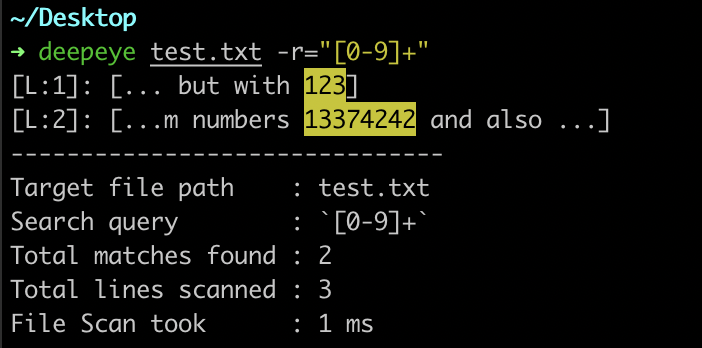
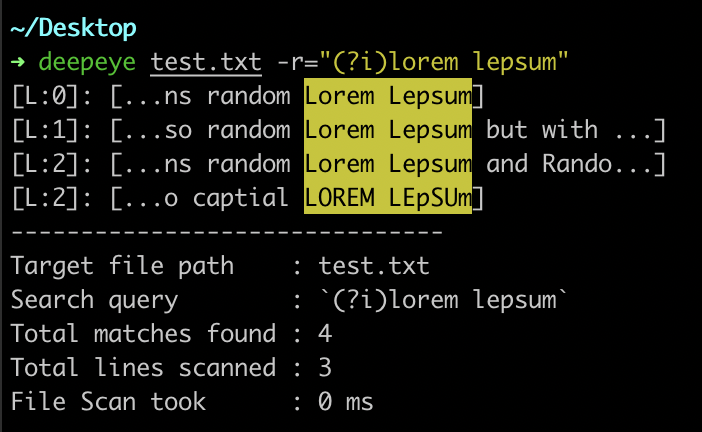
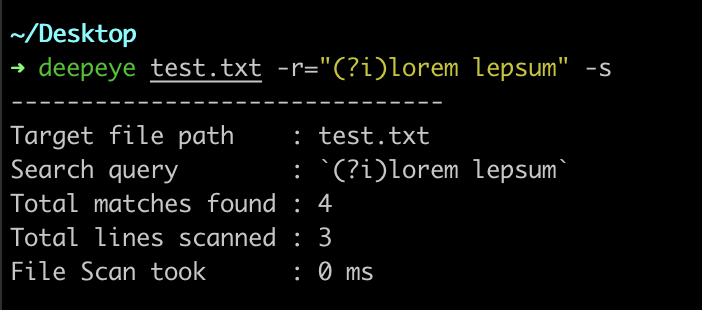

## Description:
**DeepEye** a CLI  that simply help you make search queries through files quickly using plain text or regex expressions, while having detailed output about it.
The project meant to be simple and HELPFUL/
Suggestions and helps are welcome :) 
## Usage:
```
~/Desktop
➜ deepeye -h

DeepEye: a CLI that will allow you to run advanced search queries
	through multile text files, while having customized + detailed output.
	The "deepeye" program was mainly focused on helping terminal users,
	to quickly search in files in both plain text and regex queries.

Willing to contribute ? : "https://github.com/aallali/deepeye"

Author: Abdellah Allali <hi@allali.me>
Birth: 24/05/2023

Usage:
  deepeye <filename> flags [flags]

Flags:
  -h, --help             help for deepeye
  -k, --keyword string   Keyword to match in file.
  -r, --regex string     regex expression to match in file.
  -s, --silent           if you want to silent the comand, only resume will be printed.
  -u, --update           check for updates.
  -v, --version          output the current installed version of DeepEye CLI.

~/Desktop
➜ deepeye -v
DeepEye version : 0.0.1
```
## Examples:
- *test.txt* file content that we going test with, contains 3 lines and random text.

- search the keyword "123" as plain text using `-k --keyword` flag
    **`deepeye test.txt -k="123"`**
    
- search for any series of numbers by regex expression using `-r` flag
    **`deepeye test.txt -r="[0-9]+"`**

- search for the any match of "lorem lepsum" ignoring case sensivity by regex expression using `-r --regex` flag
    **`deepeye test.txt -r="(?i)lorem lepsum"`**

- make the previous search query but without printing the matches with the silent flag `-s --silent`



## Features:
- ✅ search with text keyword
- ✅ search with regex expression
- ⏳ add option to choose output : full line of match OR match with N chars range around it
- ⏳ add option to limit number of lines to output.
- ⏳ make the auto update functionality
- ⏳ write installer script
- ⏳ add history DB option (pick already used queries)

✅ = Ready to use
⏳ = In progress
## ToFix:
- ⏳ make real fix to use case of `SubSWithRange(...)` in Regex option to prevent it from running over unmatched regex but same keyword.
## installation:
- TODO
## Releases:
- XX/05/2023 : **0.0.1**


## Maintainers:
- [Abdellah Allali](https://github.com/aallali)
- [your name here](./CONTRIBUTING.md)

## Contributors:
- Be the first :) 

## Licence:
MIT License